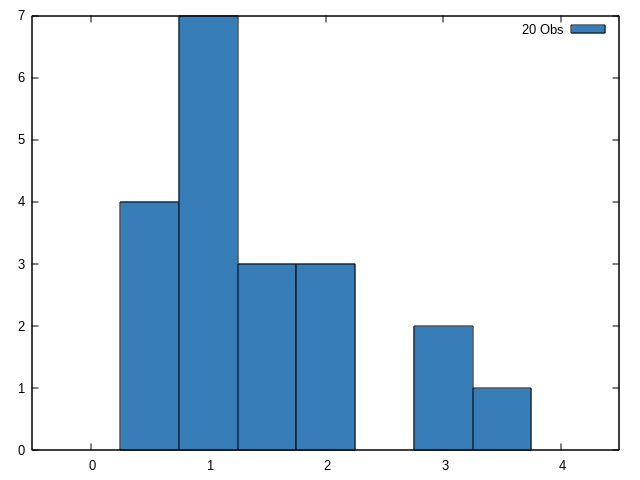
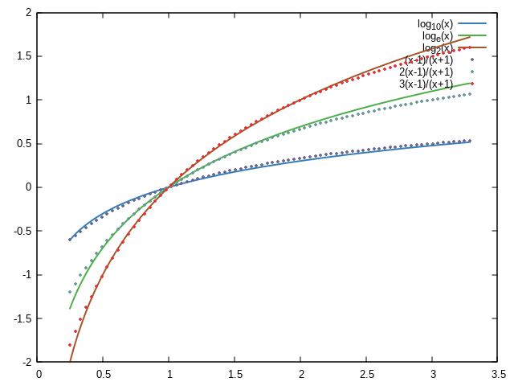
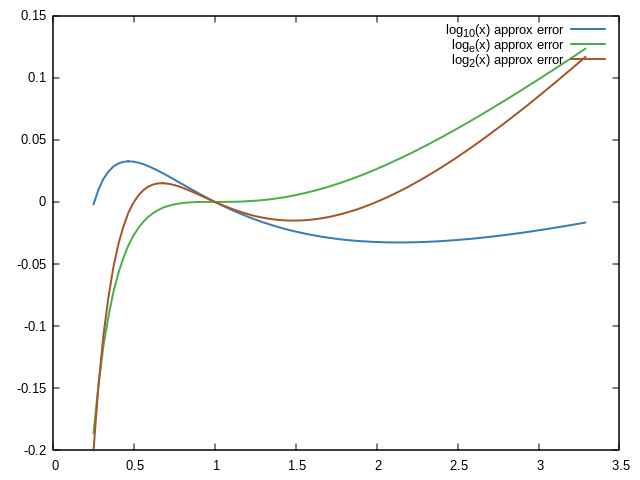
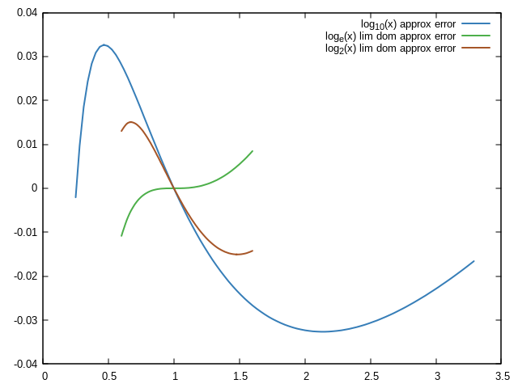
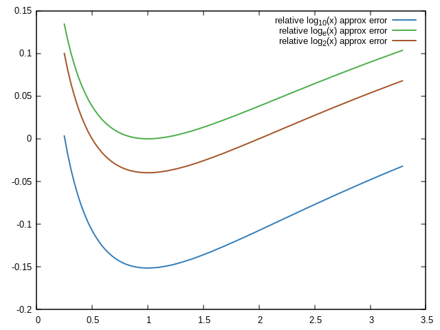

## CLMATH

**Package:** src/e/clmath-main/

**Name:** CLMATH

**Author(s):** Gerald Roylance

**Adapted for:** SBCL 2.4.4

**Maintainer:** Victor C

### Brief:

   Common Lisp Library for Mathematical Functions by Gerald Roylance,
   adapted to work with modern SBCL versions.

### Important:

   Gerald Roylance holds the copyright of the original. Packaged file by
   Scott Brown.

### Changes:

   **./functions/gamma.lisp:** double-float compatibility for new SBCL
   versions

### Adaptations:

   **./quad-ga.lisp:** Gaussian Quadrature with Legendre polynomials by
   Richard Fateman.

### Implementations:

   **./gnuplot.lisp:** Common Lisp GNUPLOT Interface by Victor C

   **./lwm.lisp:** Linear Algebra Lightweight Matrices by Victor C. It
   complements the matrix.lisp
   
   **./ltstats.lisp:** Lightweight Statistics by Victor C. It complements
   the statis/statis.lisp

### Goals:

   - This repository brings a Mathematical Modern Library for LISP
     coders to spread this excellent, stable, and mature programming
     language.
   
   - The only changes over the original code will be about types and
     subtypes when the new version of the compiler requires it.
   
   - New adaptations and implementations will be remarked on the
     README.md file.

### Compiling and Loading in SBCL:

   Unpacking the zip file will create a folder called clmath-main.
   E.g., /home/science/src/e/clmath-main/

```
(require :asdf)
(asdf:load-asd (merge-pathnames "clmath.asd" #P"/home/science/src/e/clmath-main/"))
(asdf:load-system :clmath)
```

### Examples:

   **1.** Simple Legendre 4th degree Polynomials Regressor. For data
      completion and predictions.

```
(let*
    ((N 50)
     (x (clmath:linspace -1 1 N))
     (a (list -0.001 0.01 0.55 1.5 1.2))
     ;; Random signal
     (y (map 'list
	     #'(lambda(s)
		 (+ (* (nth 0 a) (clmath:legendre_p 0 s)) (* (nth 1 a) (clmath:legendre_p 1 s))
		    (* (nth 2 a) (clmath:legendre_p 2 s)) (* (nth 3 a) (clmath:legendre_p 3 s))
		    (* (nth 4 a) (clmath:legendre_p 4 s)) (* 0.2 (nth 0 (clmath:rndn 0 1 1))) )) x))
     ;; Making Legendre Linear
     (Xm (map 'list
	      #'(lambda(s)
		  (list 
		   (clmath:legendre_p 0 s) (clmath:legendre_p 1 s)
		   (clmath:legendre_p 2 s) (clmath:legendre_p 3 s)
		   (clmath:legendre_p 4 s) )) x))
     ;; Training and Getting the Coefficients
     (c (nth 0 (clmath:transpose-lmat
		(clmath:mat-to-cspl
		 (clmath:lstsq (clmath:cspl-to-mat Xm) (clmath:cspl-to-mat (clmath:transpose-lmat (list y))))
		 )) ))
     ;; Predictions
     (w (clmath:linspace -1 1 N))
     (yhat (map 'list
		#'(lambda(s)
		    (+ (* (nth 0 c) (clmath:legendre_p 0 s)) (* (nth 1 c) (clmath:legendre_p 1 s))
		       (* (nth 2 c) (clmath:legendre_p 2 s)) (* (nth 3 c) (clmath:legendre_p 3 s))
		       (* (nth 4 c) (clmath:legendre_p 4 s)) )) w)) )
  ;; Ploting results
  (clmath:setplot x y (clmath:gppal 0 "circles title \"observed\"")
		  "set style circle radius 0.01; set style fill solid 1.0")
  (clmath:setplot w yhat (clmath:gppal 5 "lines smooth csplines title \"predicted\" ls 1")
		  "set style line 1 linewidth 3; set style fill solid 1.0")
  (clmath:showplots)
  )
```

   Output **1.**


   **2.** Histogram.

```
(defvar ll (list 1.45	2.20	0.75	1.23	1.25
 		 1.25	3.09	1.99	2.00	0.78
 		 1.32	2.25	3.15	3.85	0.52
 		 0.99	1.38	1.75	1.22	1.75))

(clmath:hist ll)
```

   Output **2.**



   **3.** Multiple plots. Based on [Logarithm approximation by John D. Cook.](https://www.johndcook.com/blog/2024/05/12/logarithm-approximation-error/)

$$Log_{10}(x) \approx \frac{(x-1)}{(x+1)}$$

$$Log_e(x) \approx \frac{2(x-1)}{(x+1)}$$

$$Log_2(x) \approx \frac{3(x-1)}{(x+1)}$$

```
(let*
    ((x (clmath:linspace 0.25 3.25 75))
     (xl (clmath:linspace 0.6 1.6 25))
     ;; Actual functions
     (yA (map 'list
	      #'(lambda(m)
		  (log m 10))
	      x))
     (yE (map 'list
	      #'(lambda(m)
		  (log m (exp 1.0d0)))
	      x))
     (y2 (map 'list
	      #'(lambda(m)
		  (log m 2))
	      x))
     ;; Approximate functions
     (yAa (map 'list
	       #'(lambda(m)
		   (/ (- m 1) (+ m 1)))
	       x))
     (yEa (map 'list
	       #'(lambda(m)
		   (/ (* 2 (- m 1)) (+ m 1)))
	       x))
     (y2a (map 'list
	       #'(lambda(m)
		   (/ (* 3 (- m 1)) (+ m 1)))
	       x))
     ;; We compute the error between actual and approximate functions
     (yAerr (map 'list
		 #'(lambda(m)
		     (- (log m 10) (/ (- m 1) (+ m 1))))
		 x))
     (yEerr (map 'list
		 #'(lambda(m)
		     (- (log m (exp 1.0d0)) (/ (* 2 (- m 1)) (+ m 1))))
		 x))
     (y2err (map 'list
		 #'(lambda(m)
		     (- (log m 2) (/ (* 3 (- m 1)) (+ m 1))))
		 x))
     ;; We limit just Logₑ(x) and Log₂(x) domains for graphical purposes
     (yElerr (map 'list
		  #'(lambda(m)
		      (- (log m (exp 1.0d0)) (/ (* 2 (- m 1)) (+ m 1))))
		  xl))
     (y2lerr (map 'list
		  #'(lambda(m)
		      (- (log m 2) (/ (* 3 (- m 1)) (+ m 1))))
		  xl))
     ;; We compute the relative error between actual and approximate functions
     (yArerr (map 'list
		  #'(lambda(m)
		      (/ (- (log m 10) (/ (- m 1) (+ m 1))) (log m 10)))
		  x))
     (yErerr (map 'list
		  #'(lambda(m)
		      (/ (- (log m (exp 1.0d0)) (/ (* 2 (- m 1)) (+ m 1))) (log m (exp 1.0d0))))
		  x))
     (y2rerr (map 'list
		  #'(lambda(m)
		      (/ (- (log m 2) (/ (* 3 (- m 1)) (+ m 1))) (log m 2)))
		  x))
     )
  ;; Plotting results
  ;; Actual vs Approximate
  (clmath:setplot x yA (clmath:gppal 0 "lines smooth csplines title \"log_{10}(x)\" ls 1")
		  "set style line 1 linewidth 2; set style fill solid 1.0")
  (clmath:setplot x yE (clmath:gppal 1 "lines smooth csplines title \"log_e(x)\" ls 1")
		  "set style line 1 linewidth 2; set style fill solid 1.0")
  (clmath:setplot x y2 (clmath:gppal 5 "lines smooth csplines title \"log_2(x)\" ls 1")
		  "set style line 1 linewidth 2; set style fill solid 1.0")
  (clmath:setplot x yAa (clmath:gppal 8 "points title \"(x-1)/(x+1)\" ls 1")
		  "set style line 1 pointtype 7 pointsize 0.5; set style fill solid 1.0")
  (clmath:setplot x yEa (clmath:gppal 9 "points title \"2(x-1)/(x+1)\" ls 1")
		  "set style line 1 pointtype 7 pointsize 0.5; set style fill solid 1.0")
  (clmath:setplot x y2a (clmath:gppal 7 "points title \"3(x-1)/(x+1)\" ls 1")
		  "set style line 1 pointtype 7 pointsize 0.5; set style fill solid 1.0")
  (clmath:showplots)
  ;; Logarithm approximation errors
  (clmath:setplot x yAerr (clmath:gppal 0 "lines smooth csplines title \"log_{10}(x) approx error\" ls 1")
		  "set style line 1 linewidth 2; set style fill solid 1.0")
  (clmath:setplot x yEerr (clmath:gppal 1 "lines smooth csplines title \"log_e(x) approx error\" ls 1")
		  "set style line 1 linewidth 2; set style fill solid 1.0")
  (clmath:setplot x y2err (clmath:gppal 5 "lines smooth csplines title \"log_2(x) approx error\" ls 1")
		  "set style line 1 linewidth 2; set style fill solid 1.0")
  (clmath:showplots)
  ;; Logarithm approximation errors w/limited domain for visualization purposes
  (clmath:setplot x yAerr (clmath:gppal 0 "lines smooth csplines title \"log_{10}(x) approx error\" ls 1")
		  "set style line 1 linewidth 2; set style fill solid 1.0")
  (clmath:setplot xl yElerr (clmath:gppal 1 "lines smooth csplines title \"log_e(x) lim dom approx error\" ls 1")
		  "set style line 1 linewidth 2; set style fill solid 1.0")
  (clmath:setplot xl y2lerr (clmath:gppal 5 "lines smooth csplines title \"log_2(x) lim dom approx error\" ls 1")
		  "set style line 1 linewidth 2; set style fill solid 1.0")
  (clmath:showplots)
  ;; Logarithm relative approximation errors
  (clmath:setplot x yArerr (clmath:gppal 0 "lines smooth csplines title \"relative log_{10}(x) approx error\" ls 1")
		  "set style line 1 linewidth 2; set style fill solid 1.0")
  (clmath:setplot x yErerr (clmath:gppal 1 "lines smooth csplines title \"relative log_e(x) approx error\" ls 1")
		  "set style line 1 linewidth 2; set style fill solid 1.0")
  (clmath:setplot x y2rerr (clmath:gppal 5 "lines smooth csplines title \"relative log_2(x) approx error\" ls 1")
		  "set style line 1 linewidth 2; set style fill solid 1.0")
  (clmath:showplots)
  )
```

   Output **3.1** Actual vs Approximate



   Output **3.2** Logarithm approximation errors



   Output **3.3** Logarithm approximation errors w/limited domain for visualization purposes



   Output **3.4** Logarithm relative approximation errors


