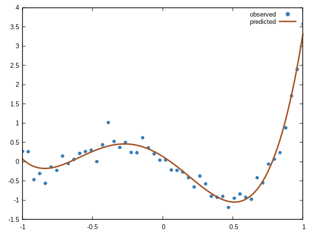

Package: src/e/clmath-main/

Name: CLMATH

Brief:

   Common Lisp Library for Mathematical Functions by Gerald Roylance,
   adapted to work with modern SBCL versions.

Author(s): Gerald Roylance

Adapted for: SBCL 2.4.4

Important:

   Gerald Roylance holds the copyright of the original. Packaged file by
   Scott Brown.

Changes:

   ./functions/gamma.lisp: double-float compatibility for new SBCL
   versions

Adaptations:

   ./quad-ga.lisp: Gaussian Quadrature with Legendre polynomials by
   Richard Fateman.

Implementations:

   ./gnuplot.lisp: Common Lisp GNUPLOT Interface by Victor C

   ./lwm.lisp: Linear Algebra Lightweight Matrices by Victor C. It
   complements the matrix.lisp
   
   ./ltstats.lisp: Lightweight Statistics by Victor C. It complements
   the statis/statis.lisp

Goals:

   - This repository brings a Mathematical Modern Library for LISP
     coders to spread this excellent, stable, and mature programming
     language.
   
   - The only changes over the original code will be about types and
     subtypes when the new version of the compiler requires it.
   
   - New adaptations and implementations will be remarked on the
     README.md file.

Maintainer: Victor C

Examples:

   1. Simple Legendre 4th degree Polynomials Regressor. For data
      completion and predictions.

```
(let*
    ((N 50)
     (x (clmath:linspace -1 1 N))
     (a (list -0.001 0.01 0.55 1.5 1.2))
     ;; Random signal
     (y (map 'list
	     #'(lambda(s)
		 (+ (* (nth 0 a) (clmath:legendre_p 0 s)) (* (nth 1 a) (clmath:legendre_p 1 s))
		    (* (nth 2 a) (clmath:legendre_p 2 s)) (* (nth 3 a) (clmath:legendre_p 3 s))
		    (* (nth 4 a) (clmath:legendre_p 4 s)) (* 0.2 (nth 0 (clmath:rndn 0 1 1))) )) x))
     ;; Making Legendre Linear
     (Xm (map 'list
	      #'(lambda(s)
		  (list 
		   (clmath:legendre_p 0 s) (clmath:legendre_p 1 s)
		   (clmath:legendre_p 2 s) (clmath:legendre_p 3 s)
		   (clmath:legendre_p 4 s) )) x))
     ;; Training and Getting the Coefficients
     (c (nth 0 (clmath:transpose-lmat
		(clmath:mat-to-cspl
		 (clmath:lstsq (clmath:cspl-to-mat Xm) (clmath:cspl-to-mat (clmath:transpose-lmat (list y))))
		 )) ))
     ;; Predictions
     (w (clmath:linspace -1 1 N))
     (yhat (map 'list
		#'(lambda(s)
		    (+ (* (nth 0 c) (clmath:legendre_p 0 s)) (* (nth 1 c) (clmath:legendre_p 1 s))
		       (* (nth 2 c) (clmath:legendre_p 2 s)) (* (nth 3 c) (clmath:legendre_p 3 s))
		       (* (nth 4 c) (clmath:legendre_p 4 s)) )) w)) )
  ;; Ploting results
  (clmath:setplot x y (clmath:gppal 0 "circles title \"observed\"")
		  "set style circle radius 0.01; set style fill solid 1.0")
  (clmath:setplot w yhat (clmath:gppal 5 "lines smooth csplines title \"predicted\" ls 1")
		  "set style line 1 linewidth 3; set style fill solid 1.0")
  (clmath:showplots)
  )
```

Output:



   2. Histogram.

```
(defvar ll (list 1.45	2.20	0.75	1.23	1.25
 		 1.25	3.09	1.99	2.00	0.78
 		 1.32	2.25	3.15	3.85	0.52
 		 0.99	1.38	1.75	1.22	1.75))

(clmath:hist ll)
```

Output:


